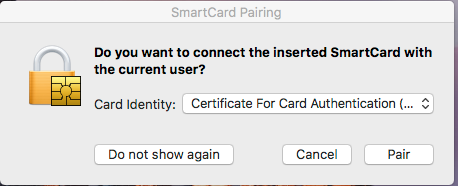
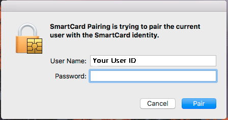

_This document applies to Sierra OS only. It is not meant for Mac OS versions earlier than 10.12.3._

## System Requirements
* Mac iMac or MacBook that is from 2010 or newer
* 4 GB Ram, 8 GB Ram recommended
* Core 2 Quad processor minimum, i5/i7 processor recommended
* [Smart Card Reader](../start/#card-readers)

## Enable the Smart Card

### Turn on Smart Card Services

1. Create a Managed Mobile profile for the user, and have them set an account password.
2. Open a Terminal window, and enter the following command with elevated privileges:
>`sudo security authorizationdb smartcard enable` 
 
>Smart Card services should now be enabled for the system. To check use the following command: 
>`sudo security authorizationdb smartcard status` 
3. Now you can pair the user’s smart card with the account.

### Pair the User’s Smart Card to their Account

1. Make sure the smart card reader is plugged into a USB port.
2. A dialog box should pop up when you insert the user’s smart card.
 
3. Select the certificate for PIV Authentication in the drop-down menu.
 
4. The system will prompt for an elevated user to authorize the pairing of the PIV Certificate to the user’s account.
 
5. The process should be complete as soon as you click "Pair". The next time the user logs in, they will be prompted for their PIN, and they system will replace the current keychain password.

## Resources

Here is the command syntax for the `security authorizationdb` terminal command function:

`authorizationdb read <right-name>` 
`authorizationdb remove <right-name>` 
`authorizationdb write <right-name> [allow|deny|<rulename>]` 
Read/Modify authorization policy database. Without a rulename write will read a dictionary as a plist from stdin. 
`authorizationdb merge source <destination>` 
If no destination path is specified, merge will merge to /etc/authorization. 
`authorizationdb smartcard <right-name> <enable|disable|status>` 
Enables/disables smartcard login support or report current status. 

## Implementation Plan for User Migration

You should perform smart Card pairing on a user's first login - we recommend pairing the account immediately after imaging, during the initial system setup session with the user.

For systems using Yosemite OS, we recommend a clean install followed by a manual transfer of user home folder data, because Yosemite OS' built-in smart card enforcement mechanisms are not compatible with Sierra OS' Secure Integrity Protection protocols.

## Known Risks / Issues

### Risk 1: Issues Temporarily Un-enforcing and Re-enforcing a PIV-enabled User

This version of the Playbook does not cover methods to temporarily un-enforce and re-enforce a PIV-enabled user. 

When you implement Smart Card enforcement for a user, the system changes the way passwords are handled in the Sierra OS keychain.
Sierra changes the storage location of keychain passwords in the Secure Integrity Protection (SIP) area of the operating system, which makes it impossible to assign a user a randomized temporary password that can be replaced by a user’s PIV card pin when you re-enable enforcement. 

Therefore, you must either allow a known password to be used during an un-enforced period, or you must find a way to conceal the user password during the period of temporary un-enforcement, such that the user is the sole person in possession of the credentials. JSS version 9.98 may resolve this, but this is not confirmed.

### Risk 2: Digital Signing and Encryption using Outlook 365

Sierra currently cannot read digital signing and encryption certificates from the PIV card, and pass them to Outlook 365 to sign emails. This issue exists across all client Operating Systems (Windows, Mac, Linux), and Agencies are working with the Apple Development team to address this. If your Agency uses Outlook 365, we recommend that you descope mail signing from your initial PIV requirements.

## Enterprise Connect PKI
The Enterprise Connect PKI tool is still in its final beta stages, and is subject to change. 
Enterprise Connect enables Mac users to use Kerberos authentication and access mapped network drives. More information is available at [https://www.jamf.com/jamf-nation/discussions/17757/about-enterprise-connect](https://www.jamf.com/jamf-nation/discussions/17757/about-enterprise-connect). To use it, you can install the Beta 3 package located in the Sierra/Beta Software folder on the Apple$ Share.
Once it is installed, it will ask you for your smart card pin for sign in:
Network Share drives that have been added to Enterprise Connect will automatically mount after login.

You can [contribute]({{ site.baseurl }}/contribute/) to this effort or open an [Issue]({{site.repo_url}}/issues) to discuss a need you may have for a guide.
