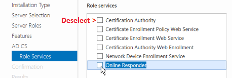

#Locally Trusted OCSP Configuration

####Table of Contents
####[Introduction](#Introduction-1)
####[Security Risks](#Security-Risks-1)
####[Prerequisites](#Prerequisites-1)
####[Locally Trusted Microsoft OCSP Responder](#Locally-Trusted-Microsoft-OCSP-Responder-1)
####[Windows Client Configuration](#Windows-Client-Configuration-1)
####[End-to-End Testing](#End-to-End-Testing-1)

----------

##Introduction
In Public Key Infrastructure (PKI), Online Certificate Status Protocol (OCSP) is functionally a replacement for  Certificate Revocation Lists (CRLs). An OCSP response, like a CRL, provides the revocation status of a certificate. That is, it tells you whether a given certificate has been revoked by its issuer. If you rely on certificate status provided by external, Internet hosted sources for critical functionality within your local network, it may make sense to ensure availability by creating a locally hosted (and locally trusted) copy of critical revocation status information using a locally trusted OCSP responder. Hosting this service locally can ensure clients will operate normally in the event of Internet disruptions, outages, or problems related to the remote hosting of CRLs/OCSP.

Another important observation is that once configured, mobile clients such as laptops, tablets, and phones can leverage the locally trusted service even when remote, i.e. over the Internet, if the OCSP responder is exposed to the Internet. Given that clients should be able to fail over to the next revocation status source as necessary, this additional revocation source can add additional resiliency for your users both on and off the local network. If you wish to leverage this or possibly in the future, it is recommended that you choose a server name that can be associated with an Internet address.

##Security Risks
By operating a locally trusted OCSP responder, you are assuming all risks introduced by not depending directly on the authoritative revocation status sources. Certification Authorities (CAs) follow stringent requirements involving the multi-person control, extensive physical security, and hardware cryptographic modules. These policies and procedures are detailed in each CA's Certificate Policy (CP) and Certification Practices Statement (CPS).  If you do not implement equivalent security controls, then your local OCSP responder becomes the weak link in the chain; the overall assurance level should effectively be reduced to that of your local configuration. For example, if you are validating PIV authentication certificates (hardware), but you are using software cryptographic keys on your local OCSP responder, then the assurance level of the validated certificates may be viewed as software assurance rather than hardware. This may be perfectly acceptable for some use cases while for others it is not. This is a local risk decision that should receive careful consideration and shape your deployment design.

A locally trusted OCSP Responder should not be trusted by any clients that are not explicitly configured to trust it. Therefore, the CA used for issuing the OCSP Responder certificates should not be trusted outside of your intended pool of clients for any purposes. 

A common misunderstanding is viewing an OCSP check is the same thing as certificate validation - this is a dangerous and completely inaccurate assumption. The proper procedures for certificate path validation can be found in section 6 of [RFC 5280](https://www.ietf.org/rfc/rfc5280.txt).

##Prerequisites
####Required
 - A CA to issue OCSP responder certificates
 - Windows 2012 R2 server
####Recommended:
 - Hardware Security Module (HSM)
 - Certificate Policy (CP) and Certification Practices Statement (CPS):  Documented security policies and procedures for deployment and operation OCSP responder certificate issuing CA and the OCSP responder(s).
	 - Recommend leveraging one or more relevant CP(s) published by a CA(s) you rely on for requirements.

> <i class="icon-info"></i>  CA installation, HSM configuration, and policy documents are not covered in this document.

Before you begin, it is recommended that you review the [Implementing an OCSP responder](https://blogs.technet.microsoft.com/askds/2009/06/24/implementing-an-ocsp-responder-part-i-introducing-ocsp/) series on Microsoft TechNet. These documents include supporting information that has been omitted from this document.

##Locally Trusted Microsoft OCSP Responder
Microsoft Windows Server 2012 R2 was chosen for inclusion in this document because it is generally available across Federal agencies. Please note that other products may be configured to provide locally trusted service and until such time as additional guidance is available you are encouraged to speak directly with these product vendors regarding configuration. 

###Installation
Before beginning the installation, ensure your server is named and joined to the appropriate domain. Changing the server name or domain after installation can corrupt the configuration. Your server will also need outbound Internet access to download remote CRLs. In most cases, CRLs are available over HTTP/80.

####Add the Active Directory Certificate Services role to the Server
Use the *Add Roles and Features Wizard* to add the *Active Directory Certificate Services* (ADCS) role to Windows 2012 R2.

The wizard will prompt you add required features, add them, and then continue through the wizard until you reach *Role Services*. At this point, ensure you remove Certification Authority, and add Online Responder.

The wizard will prompt you to *Add features that are required for Online Responder*, click *Add features*, then continue with the wizard and click *Install*. After the wizard finishes installing, click *Configure Active Directory Certificate Services on the destination server* inside the Results window.

Assuming you are logged on the the server with (at least) local administrator rights, it is not be necessary to change the credentials in the *AD CS Configuration* wizard. Click through the wizard, click *Configure* then *Close* when it finishes. You can now close the *Add Roles and Features Wizard*. As a best practice, you may wish to reboot the server before continuing.

###Configure Revocation Sources
Every issuer CA certificate must be individually configured 
General guidance on CRL update frequency

####Manually Adding a Revocation Source
Step by step, with screen shots

####Using PowerShell to Add a Revocation Source

	include code sample

##Windows Client Configuration 

###Manual Client Configuration
mmc.exe to configure local certificate store properties

###Group Policy Configuration
group policy editor

##End-to-End Testing

###Windows certutil
Use certutil and CAPI 2 event logging to test and debug operation

###Common problems and solutions
Event log entries, what they means, how to fix them
