# Locally Trusted OCSP Configuration

#### Table of Contents
#### [Introduction](#introduction-1)
#### [Security Risks](#security-risks-1)
#### [Prerequisites](#prerequisites-1)
#### [Install Microsoft OCSP Responder](#install-microsoft-ocsp-responder-1)
#### [Windows Client Configuration](#windows-client-configuration-1)
#### [End-to-End Testing](#end-to-end-testing-1)

----------

## Overview <!-- LaChelle's template.md in various locations suggestions that "Overview" should be 1st section.  This intro. conforms well to "Overview," so recommend using that title. -->

Within the **Public Key Infrastructure (PKI)**, the **Online Certificate Status Protocol (OCSP)** is used to determine the status of a public key certificate (RFC 2560, FIPS 201-2). An OCSP Responder <!-- Is Responder correct here or should it be "Client and Responder"? -->can functionally replace **Certificate Revocation Lists (CRLs)**, which are "list[s] of revoked public key certificates created and digitally signed by a **Certification Authority**" **(CA)** (FIPS 201-2, NIST SP 800-63, CNSSI 4009) (i.e., the issuer that certified it in the first place). A response from an OCSP Responder<!-- a definition would be helpful. -->, as with a CRL, will tell you whether a public key certificate has been revoked by its CA. If your organization relies on Internet-hosted sources <!-- Are Internet-hosted sources ever "internal"? -->for your local network's critical functionality, including the ability to verify certificate statuses, you could use an OCSP Responder, instead of CRLs. <!-- availability of what? -->In this case, your locally trusted OCSP Responder (service) would create a locally hosted, trusted copy of revoked certificate information<!-- Where does the OCSP copy the info from? -->. Hosting a local OCSP Responder can ensure that clients (applications and devices)<!-- Correct for "clients"? -->do not experience the Internet disruptions <!-- Just "disruptions" is used below. -->that can occur with either remotely hosted CRLs or OCSP.

If a locally trusted OCSP Responder <!-- Responder?  Client and Responder? -->is deployed, even mobile clients such as laptops, tablets, and phones could potentially <!-- Explain "potentially." -->use it when remote<!-- "Remote" means using wireless capability that is not part of an agency's or company's wireless? --> (i.e., if your organization configures the OCSP Responder to be exposed to the Internet). Clients (applications and devices) should always be configured to "fail-over" to a backup<!-- Backup vs. "next" is more clear. --> source for obtaining certificate-revocation statuses in the event of an Internet disruption. <!-- Are you saying that the OCSP Responder can be that backup source (unclear)? -->A locally trusted OCSP Responder could be that backup source--providing additional resiliency for users who are working on the local network or connected remotely. If considering this service, we highly recommended increasing its security by choosing a server name associated with an Internet Protocol (IP) <!-- Did you mean IP? -->address, as discussed in the **_Install Microsoft Windows Server 2012 R2 as an OCSP Responder_** below.

  > **Transparent Caching Proxy -- an Alternative Backup (Fail-over) Method.** The **Transparent Caching Proxy** may <!-- "May" sounds uncertain. What could be the problem area? -->provide sufficient backup resiliency<!-- Does this method provide greater security? If so, we ought to say that. --> to preclude the need for a locally trusted OCSP. When configured properly<!-- Explain "proper configuration. -->, a Transparent Caching Proxy is a highly effective method of obtaining and providing CRLs during Internet, CRL, or OCSP service disruptions. This proxy also greatly reduces Internet connection-bandwidth consumption. To use this system, configure it to frequently check the end-point <!-- End-point is what? Need clarification. Also, explain file types that follow. -->for modified **.p7c** and **.crl** files so that the cache maintains the most up-to-date information. In addition, consider configuring a script on any host "behind" the transparent cache to regularly download chosen CRLs. This will keep the cache "fresh" even when users on the local network are not downloading CRLs during off-peak (i.e., non-working) hours.<!-- How does user download of CRLs during off-peak hours effect freshness of cache (unclear)? --> For additional information on configuring a Transparent Caching Proxy, see _(insert link to relevant document here)_.

## Assumptions

To be able to effectively use these OCSP Responder procedures, we recommend that you possess the following: <!-- Since this guide requires a technical user, where the "assume no prior knowledge" is not appropriate, we might add Assumptions about the user's level of expertise in relevant areas. I took a guess at these.  In LaChelle's template.md for some repos includes a section in this position called "Assumptions," recommend we use that here -->:

  * System administrator (SA) or network administrator privileges/permissions 
  * Experience with network configurations  
  * Experience with installing and configuring servers
  * Experience with certificate issuance and revocation practices
  * Experience with CAs
  * Experience using CPs and CPSs

## Security risks <!-- The uninitiated will most likely have trouble following the discussion in this paragraph. -->

By operating a locally trusted OCSP Responder, your organization is assuming all of the security risks introduced when you do not depend directly on the authoritative revocation status sources (i.e., CAs). <!-- LL has given guidance about doc. prep. that we are to assume the reader has no prior knowledge of the subject matter. Are the sources = the CAs & they are normally consulted for accurate CRLs (unclear)? Does the OCSP Responder extract the CRL information from the CA and so is not a "direct" (more secure) means? -->CAs follow stringent <!-- Are the policies and procedures the CP and CPS mentioned in next sentence (unclear)? Explain "multi-person control" for reader. -->requirements for multi-person control, physical security<!-- How does physical security relate to CRLs? -->, and hardware cryptographic modules <!-- Hardare mentioned here but not software (which is mentioned below). -->, which are detailed in each CA's **Certificate Policy (CP)** and **Certification Practices Statement (CPS)**.  If you do not implement equivalent security controls to those implemented by a CA (i.e., as stated in a CP and CPS), then your local OCSP Responder becomes the weak link in the chain, and your organization's overall <!-- ? -->network-security assurance level would effectively be reduced to that of your local network configuration. <!-- Local vs. ___? -->For example, if your organization validates **Personal Identity Validation (PIV)** authentication certificates (hardware)<!-- "Hardware certificates" relate to a PIV card used for computer access to a network? -->, but you are using software cryptographic keys on your local OCSP Responder, then the validated PIV certificates' <!-- For PIV? -->assurance level may be associated with software rather than hardware, both of which have different CP and CPS requirements. <!-- Is this what you meant? -->This may or may not be acceptable, depending on the **use case**. 

Some other security best practices to consider when implementing an OCSP Responder: 

  * No clients (applications and devices) should ever trust a locally trusted OCSP Responder unless they have been explicitly configured to do so. <!--How would a client trust the OCSP Responder without being configured to do so? -->
  
  * The CA you use must be private to your organization. 
  
  * The CA and issued OCSP Responder certificates should not be trusted outside of your intended pool of clients for any purposes. 
  
  * A common misunderstanding is viewing an OCSP check is the same thing as certificate validation--this is a _dangerous and completely inaccurate assumption_. The proper procedures for certificate path validation can be found in section 6 of [RFC 5280](https://www.ietf.org/rfc/rfc5280.txt), _Internet X.509 Public Key Infrastructure Certificate and Certificate Revocation List Profile_.

These are examples of an agency's or organization's local risk decisions that must be carefully considered. Security best practices and sound risk decisions should always shape a deployment design for an OSCP Responder.

## Before you begin

Before you begin, we recommend that you review the OCSP document series available from Microsoft TechNet:  [Implementing an OCSP Responder](https://blogs.technet.microsoft.com/askds/2009/06/24/implementing-an-ocsp-responder-part-i-introducing-ocsp/). Microsoft's document series includes supporting information that has been omitted from this OSCP guide.

### Prerequisites

#### Required:

  * A locally trusted Root CA to issue OCSP Responder certificates
  * Microsoft Windows 2012 R2 server

Because of its limited (OCSP only), local-network-only scope, and special content (only certificate-revocation statuses) requirements <!-- Is this what you meant?  Wasn't quite clear. -->, we recommend that a new, dedicated **Root CA** be used to issue locally trusted, OCSP Responder certificates. 

> In a hierarchical [PKI], the [**Root CA** is the CA] whose public key serves as the most trusted datum (i.e., the beginning of trust paths) for a security domain (NIST SP 800-32, CNSSI-4009).

(The procedures below provide additional steps for installing and configuring this Root CA<!-- Which procedures specifically? -->, and Appendix 2 provides supplemental information [Appendix 2 - Using Microsoft CA as the self signed root](#Appendix-2---Using-Microsoft-CA-as-the-self-signed-root-1).)

#### Recommended: 

  * Hardware Security Module (HSM)
  * CP and CPS:  Documented security policies and procedures for deploying and operating the certificate-issuing Root CA and OCSP Responder(s). 

> <i class="icon-info"></i>  <!-- Is this supposed to display in an Info box?  It doesn't in my view. Question: Do you mean for installing CAs other than the Root CA?  I thought we do include procedures about that below..? -->This guide does not provide detailed procedures for installing CAs or configuring HSMs (i.e., numerous online resources provide CA installation procedures, and HSM vendors provide configuration procedures). Additionally, this guide does not provide instructions for creating policies (i.e., for CPs and CPSs). For guidance, we recommend that you consult the requirements contained in one or more CPs and CPSs published by a CA(s) on which you rely.

## Install Microsoft Windows Server 2012 R2 as an OCSP Responder

Microsoft Windows Server 2012 R2 was the chosen model for an OCSP Responder, because it is generally available across Federal Government agencies. Other products may also be configured to provide a locally trusted, OCSP Responder service. <!-- Are guidance documents not yet available for these other products or do you mean until procedures are added to the OCSP playbook/guide...? -->Until such time as additional guidance is available for these products, we encourage you to speak directly with the vendors regarding configuration. 

### Install Microsoft Windows Server 2012 R2 software

Before beginning the Windows Server 2012 R2 software installation, name your server and associate it <!-- Above we say "associate it with" -->with the chosen domain (i.e., IP address). <!-- Is IP address correct? --> Changing the server name or domain after installation can corrupt the configuration. Configure the server with outbound Internet access in order to retrieve and download remote CRLs. <!-- How do they set this up? Or refer them to a link for procedure. -->In most cases, CRLs are available over HTTP/80.

  1. Use the **Add Roles and Features Wizard**, and <!-- How do they locate the Wizard? Do you click on it? -->go to **Server Roles**. 
  2. Click on the **Active Directory Certificate Services** (ADCS) to add this role to the Windows Server 2012 R2.

  > The **Add Roles and Features Wizard** will prompt you to <!-- Next prompt: capitalized or all lowercase? -->**_Add required features_**. 

  3. Add the desired features, and then follow the wizard's prompts. 
  4. Locate and select **Role Services**.<!-- What is the name of the drop-down box or list where Role Services appears? --> 
  5. At this point, ensure that you **deselect** (uncheck) the checkbox for **Certification Authority**, and click on the checkbox to select **Online Responder**.

  > The wizard will then prompt you to <!-- Capital "A"? -->**_Add features that are required for Online Responder_**. 

  6. Click on <!-- Capital "A" and lowercase "f"? -->**Add features**. 
  7. Continue with the wizard's prompts, <!-- Assume wizard's prompts are easy since not stated.  --> and click on **Install**.
  <!-- Is this from a drop-down box? I can't validate steps/menus/selection method, capitals vs. not, since there are no screen shots for some of these. Not a criticism--just reality. -->
  
  > After the installion finishes, the **i - Feature Installation** window appears. 
  
  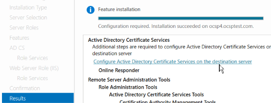
  
  8. Select **Results** from the left-hand-side panel. 
  
  > The prompt, _Configuration required. Installation suceeded on [server name]_ appears. <!--"Server name" correct for generic info.? -->
  
  9. In the **Results** window, below the **Active Directory Certificate Services** heading, click on **Configure Active Directory Certificate Services on the destination server**.

  > If you are logged into the server with (at least) local administrator rights, you do not need to change the credentials in the **AD CS Configuration** wizard. <!-- Does this wizard pop up automatically? How do you find it? Do you click on it? --> 

  10. Click through the wizard prompts. Then, click on **Configure**.  When the configuration finishes, click on **Close**. 
  11. Close the **Add Roles and Features Wizard**. 
  
  > As a best practice, reboot the server before continuing.

### Obtain OCSP Responder Certificate

Two main approaches exist for the Microsoft OCSP Responder's method of issuing and obtaining certificates:
  
  * **Preferred**: the OCSP Responder will obtain a certificate from an offline CA and manually install it.  This approach, which is described below, will provide increased security over the second approach. <!-- If preferred, this one should come first. Is it more or less secure than other appraoch? Install it where? -->
  
  * **Alternative**: The OCSP Responder will have permissions to automatically request a certificate <!-- Is this the certificate for the OCSP Responder itself?  Is the OCSP Responder the same as the Windows Server 2012 R2? -->from an online Microsoft CA that resides on the same domain. This approach, if used in a dedicated, network-isolated domain with HSMs, can be relatively secure.  (Information on this approach is available from ______.)  

> <i class="icon-info"></i>  Regardless of which approach you use, Microsoft Windows clients require every certificate in the certificate chain, **including the self-signed Root**, to express **OCSP Signing (1.3.6.1.5.5.7.3.9)** in the **Extended Key Usage** extension. <!-- "Extended...extension": I assume both are needed here (sounds redundant). The statements here I can't simplify them, as I can't follow the meaning.-->

To use the **Preferred** approach to issuing and obtaining certificates, perform the following steps: 
  
  1. Generate a new **signing key and certificate request file** by creating an **INF** (i.e., Information File Name Extension) file that specifies the details you wish to include in the request. For an example, see [Appendix 1 - Sample OCSP INF file](#Appendix-1---Sample-OCSP-INF-file-1). 
  
  2. Once you've created an INF file, open an administrative command window on the server and enter the following command:

	certreq -new <inf_filename>.inf ocsp.req

  > This command should generate a new signing key and output a **signed certificate request** to **ocsp.req**.  

  3. Deliver this request file to your CA and obtain your OCSP Responder certificate. 
  
  > **Note:** This file is Privacy-Enhanced Mail (PEM)-encoded. You can open it in Microsoft Notepad and copy/paste the content<!-- Copy content from the file and paste into Notepad? (unclear) -->.

  4. After obtaining your new OCSP Responder certificate, ensure that it meets the requirements of an OCSP Responder certificate before proceeding.  It should include all of these details:
  > * OCSP Signing (1.3.6.1.5.5.7.3.9) in the Extended Key Usage.  
      &bullet; This *should* be marked **critical.**
  > * The id-pkix-ocsp-nocheck (1.3.6.1.5.5.7.48.1.5) extension is present.  
      o Including this extension prevents clients from checking the OCSP Responder certificates' revocation status.
  > * Key Usage must contain Digital Signature (80).  
      * This *should* be marked **critical.**
  > * The Subject Alternative Name *should* contain Domain Name Server (DNS) Name = OCSP Server DNS name.

### Install OCSP Responder Certificate

  1. Copy the new OCSP Responder certificate, as well as the issuing CA certificate (or chain), to the OCSP Responder server. 
  2. If you have not already done so, install the issuing **CA Root certificate** in the **Computer Trust Root Certification Authorities store**. 
  3. Use the following command to accept the OCSP Responder certificate:

	certreq -accept <ocsp_responder_certificate_filename>.cer

  > When successful, _certreq_ will exit and provide no feedback.

> <i class="icon-info"></i>  An error message stating:  *Certificate Request Processor:  A certificate chain could not be built to a trusted root authority. 0x800b010a (-2146762486 CERT_E_CHAINING)* will indicate that the self-signed root (and intermediate CA certificates, if applicable) are not available or not in the correct certificate stores on the server. Ensure that the required CA certificates are imported into the correct **Computer account** stores. <!-- In Step 2 above, only *Computer* was italicized.  Is this related? -->

  4. To confirm that the certificate was properly imported, open the **Microsoft Management Console (MMC)** (i.e., **mmc.exe**), load the **Certificates snap-in**, and select the **Computer account** (i.e., stores). <!-- Correct?  Can't tell what the step sequence is from the screen capture. -->
  5. From the left-hand-side panel, under the **Console Root** folder, click on **Certificates (Local Computer)** and then click on the **Personal** folder.  
  6. Click on the **Certificates** folder. Then, expand the **Personal/Certificates** tree on the right-hand-side of the window. 
  7. Confirm that the newly accepted certificate is listed there.

  8. Double-click on the certificate and confirm that it appears valid, lists *OCSP Signing* under _This certificate is intended for the following purpose(s)_, and indicates below that *You have a private key that corresponds to this certificate*. 
  9. Close the certificate. <!-- How do you close it? -->

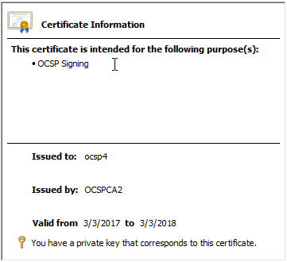

  10. Right-click on the certificate in MMC, and select **All Tasks** and then **Manage Private Keys**.

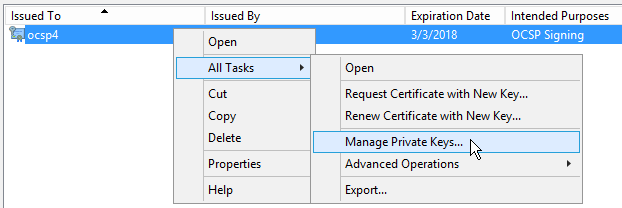

  11. When the **Permissions** dialog box appears, click on the **Add** button.

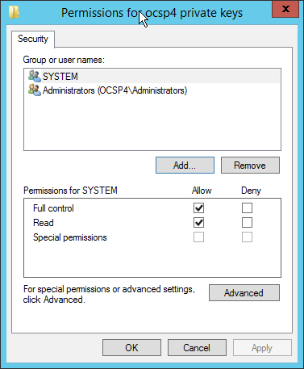

  12. If this server is on a domain, click on the **Locations** button, and select the local server's name. 
  13. Type **NETWORK SERVICE** into the **Enter the object names to select** text box, and click on the **Check Names** box. Click on **OK** when finished.
  
  > The **Permissions for [server name] private keys** window displays. 

  14. From the **Permissions...** window, select **NETWORK SERVICE**, deselect (uncheck) the **Full control** checkbox, and then click on **OK**.

  > The OCSP Responder should now be able to use the certificate and private key.

### Configure Revocation Sources

Every issuing and intermediate CA certificate to be supported by the OCSP Responder must have their own entry in **Revocation Configuration.** <!-- Where is Revocation Configuration located? -->

#### Manually add a Revocation Source

In the example images below, _Federal Bridge CA 2016_, is used as an example of a revocation source.

  1. Open the **Online Responder Management** console.  At the right-hand panel under **Online Responder**, right-click on Revocation Configuration, and then select **Add Revocation Configuration**.

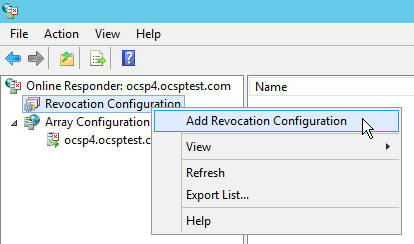

  2. At the next window, select **Name the Revocation Configuration**.  Then enter the name of your Revocation Configuration. (It is recommended that you always use the CA's common name, plus any other identifying information that may be necessary.) Click on **Next**.

> <i class="icon-info"></i>  You will need to configure separate Revocation Configurations for CAs that have more than one key pair. Name your Revocation Sources so that you can easily identify these cases.

  3. At the next window, select a **CA Certification Location**. The location can be either a Local certificate store or a File. Click on a radio button to select a location. Click on **Next**, select the CA certificate, and then click **Next** again.

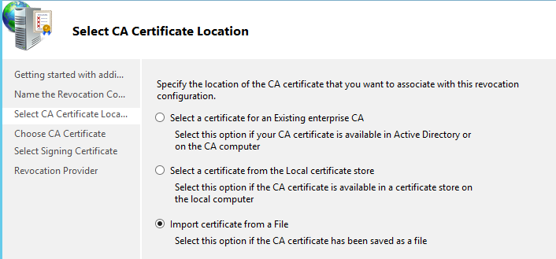

  4. At the next window, click on the radio button next to **Manually select a signing certificate**. Click on **Next**.

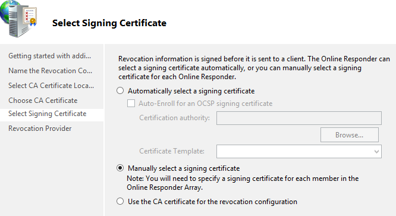

  > An error (dialog box) will appear stating that _One or more errors occurred while revocation provider settings were being configured.  Click the "provider button" to configure the revocation provider manually_... Click on **OK**.

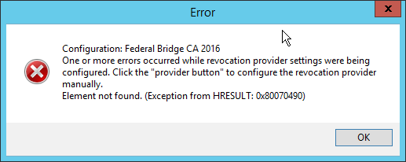

  5. At the next window, click on the **Provider** button to open the **Revocation Provider Properties** dialog box.

  6. Click **Add**, and then copy and paste the CA's **CRL distribution point URL** into the **Add the...CRL at this address (URL) to the list:** text box. (**Note:**  This URL is the CRL distribution point URL that this CA puts into the certificates it issues, **not** the URL in the CA certificate itself.) Click on **OK**.

  7. At the **Revocation Provider Properties** dialog box, deselect (uncheck) the checkbox next to **Refresh CRLs based on their validity periods**. (**Note:** This option has proven unreliable in testing.) At **Update CRLs at this refresh interval (min)**, enter a reasonable refresh interval, such as _60 minutes_, and click on **OK**.

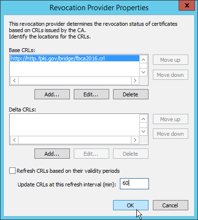

  > After completing the above steps, you will need to assign the OCSP Responder Certificate to the configuration. Until this is done, you will see the error:  _Signing Certificate: &nbsp;Not Found_ in the status panel window for this Revocation Configuration. 

  8. In the status panel window, right-click on the Revocation Configuration Name itself ("Federal Bridge CA 2016" in this example), and then select **Assign Signing Certificate**.

  > A **Windows Security** dialog box will appear that allows you to select a **Signing Certificate** (i.e., the OCSP Responder certificate). Click on the correct certificate, and click on **OK**.

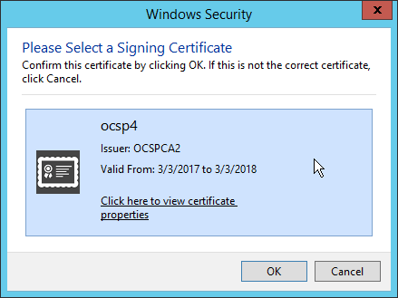

  > After selecting the certificate, the status panel will still display an error stating that *The data necessary to complete this operation is not yet available.* What this really means is that it has not yet downloaded the CRL. <!-- What is "it" here? -->

  > After waiting a few minutes, at the status panel window, right-click on **Array Configuration**, and select **Refresh**. <!-- What is the user waiting for? How long? -->This process will download the CRL.

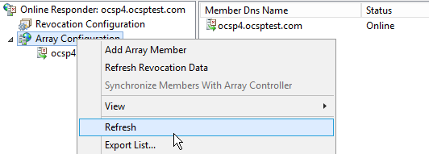

  > Once the download finishes, your status panel window should look like this:

  > If the error message appears: _The revocation provider failed with the current configuration. The object identifier does not represent a valid object. 0x800710d8 (WIN32: 4312 ERROR_OBJECT_NOT_FOUND), 0x800710d8_. This error usually indicates an incorrect CRL DP URL. <!-- What is "DP"? Don't remember that... -->

  9. Repeat this process for each CA that you want to add to the OCSP Responder.

## Configure the Windows Client

Each CA must be individually and explicitly configured. In order to maximize local availability, it important to configure all of the CAs in the certificate chain to your trusted root certificate(s). For example, additional CAs that must be configured to your trusted root certificate(s) could be a subset of the CAs that can verified by the Federal Common Policy CA. <!-- Will all users know what Federal Common Policy CA is?  (Also referred to as "COMMON"?) Will users of this guide ALL need to configure CAs that can be verified by FCPCA? Explain "maximize local availability"--of what? -->

### Manually configure the Client

To manually configure a locally trusted, OCSP Responder, **use the ""MMC** **Certificates snap-in**.   

  1. To begin, open MMC (i.e., mmc.exe).  At the screen's left-hand panel below **Console Root**, add the Certificates snap-in for the **Certificates (Local Computer)**. <!-- Right sequence? -->

  2.  Under **Intermediate Certification Authorities** and then select **Certificates.** 
  
  3. Next, at the right-hand panel, under **Issued To,** select the **CA certificate** that you want to associate with the locally trusted, OCSP Responder. <!-- Original had unclear meaning. Grammar implied that the CA certificate is already active somehow and waiting for an item to be assigned to it.  Once the OCSP Responder is assigned to the already active CA certificate, the OCSP Responder becomes "active." Correct? --> Then, right-click on the certificate and select **Properties** from the drop-down window.
  
  > The **Properties** window appears.

  4. Click on the **OCSP** tab.  In the text box, enter the **URL of your locally trusted, OCSP Responder**.

  > The Microsoft <!-- The "Microsoft" OCSP Responder has not been mentioned before. Is it the same as the "OCSP Responder" or different? -->OCSP Responder adds **ocsp** to the URL, e.g., http://[servername]/ocsp.

  5. Click on the adjacent **Add URL** button. 

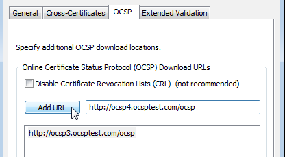

  > The URL appears on the list in the text box just below the URL text box.  
  
  6. Confirm that the URL appears in the list.

  > By using this same window, you can add and configure multiple OCSP Responder URLs. <!-- Will all of the OCSP Responders be activated by the same CA certificate or does each one require its own CA certificate? -->

  7. Click on **OK** when satisfied with your modifications. All applications that leverage Windows certificate validation APIs will now attempt to use your configured OCSP Responder when validating certificates *issued* by this CA.

### Group Policy Configuration
#### Root CA Certificate
The Locally Trusted Root CA can be distributed to clients using Group Policy. To do so, create or open the group policy object you want to use, then navigate to **Computer Configuration** / **Policies** / **Security Settings** / **Public Key Policies** / **Trusted Root Certification Authorities**. If the CA certificate is not already listed here, right click Trusted Root Certification Authorities and select Import

The Certificate Import Wizard will appear, click Next. Browse for the Locally Trusted Root CA certificate that issues the OCSP Responder certificates. Click Next, then Next again, then Finish. A dialog should appear that states *The import was successful*.

#### Locally Trusted OCSP
Configuration of Microsoft Windows domain members is possible using group policy. To get started, create or open the group policy object you want to use, then navigate to Computer Configuration / Policies / Security Settings / Public Key Policies. Next, select the Certificate Store that should contain the CA certificate. This is usually the Intermediate Certification Authorities.

> <i class="icon-info"></i>   A trust anchor such as the self signed Federal Common Policy CA should be configured in the Trusted Root Certification Authorities store.

Right click the Certificate Store name and select Import

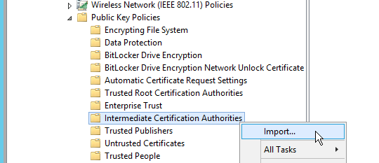

The Certificate Import Wizard will appear, click Next. Browse for the CA certificate you want to configure.

Click Next, then Next again, then Finish. A dialog should appear that states *The import was successful*.

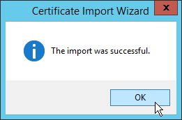

Now, and at any future time, you can configure the locally trusted OCSP Responder by right clicking on the imported certificate row and selecting Properties.

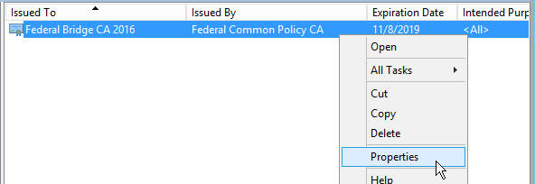

Add the OCSP URL(s) in the same manner described above in [Manual Client Configuration](#Manual-Client-Configuration-1)

## End-to-End Testing

### Windows Clients
#### Preparation
Testing is carried out using certutil.exe from the command prompt on a Windows client. For complete coverage, it is recommended that you test with all Windows versions that are expected to operate in your environment.

> <i class="icon-info"></i> If you are testing with Windows 10, you may receive "FAILED: 0x80092004 (-2146885628 CRYPT_E_NOT_FOUND)" in spite of of the certificate path apparently validating correctly. This appears to be a bug that affects certutil on Windows 10. If you experience this issue, it is recommended you test with an additional version of Windows. At the time this document was written, Windows 7 and 8.1 were confirmed to not have this issue.

You will need to have a copy of certificates **issued by** the CAs you have configured in order to test your configuration. The test will build a complete certificate path to a trusted root; it is not necessary to test the intermediate CA certificates independently if they are part of a path you test.

> <i class="icon-info"></i>  If you are using group policy to push locally trusted OCSP settings to clients, ensure the updated policy has been applied to the client

Before you test, enable CAPI2 logging on your client. Open the Event Viewer MMC Snap-in and Navigate to **Applications and Services Logs** / **Microsoft** / **Windows** / **CAPI2** / **Operational**. With "Operational" selected, click "Enable Log" in the Actions pane. Given the small 1 MB default, you may wish to increase the size of this log by by clicking Properties and updating the maximum log size value.

> <i class="icon-info"></i> Diagnostic logging has a negative performance impact. Disable this log by clicking "Disable Log" in the Actions pane after you've completed testing. 
 
If there are intermediate CA certificates required to validate each of your test certificates that are not present in the *Intermediate Certification Authorities* store, it is recommended that you install them before testing to reduce the number of log events generated during testing. Verify each of the test certificate paths can be built by double clicking each certificate and confirming it appears valid and has a certificate path in the Certification Path tab.

> <i class="icon-info"></i>  The additional events that appear when following AIA URLs to retrieve Intermediate CA certificates are not included or addressed below.

Optionally, you may want to isolate the test client from the Internet. This is highly recommended if you are attempting to deploy locally trusted OCSP in a manner that allows for ongoing operation when disconnected from the Internet. In this case, the client should be able to validate configured certificates while only having access to the locally trusted OCSP Responder. There are multiple ways to achieve this effect; one approach is to remove all DNS server entries from the client and add the OCSP Responder to the host file. If using this approach ensure you clear the DNS cache before testing:

	ipconfig /flushdns

#### Test Execution

Open the Event Viewer and navigate to **Applications and Services Logs** / **Microsoft** / **Windows** / **CAPI2** / **Operational**. Click **Clear Log** in the Actions pane.

Open a command prompt and issue the following commands, replacing "certificate.cer" with the path and file name of a certificate below:

    certutil -URLcache * delete
    certutil -verify "certificate.cer"

The first command will clear all cached certificates, CRLs, and OCSP responses. The second command will generate a lot of output detailing the content of each certificate in the certificate path and concluding with whether or not the certificate path was successfully validated. For example:

    Verified Issuance Policies:
	    2.16.840.1.101.3.2.1.3.6
		2.16.840.1.101.3.2.1.3.7
	    2.16.840.1.101.3.2.1.3.14
		2.16.840.1.101.3.2.1.3.15
    Verified Application Policies: All
    Cert is a CA certificate
    Leaf certificate revocation check passed
    CertUtil: -verify command completed successfully.

If the validation fails, you will see the message **CertUtil: -verify command FAILED** along with an error code. It can be very difficult to ascertain what went wrong from the certutil output; the CAPI2 log contains much more detail. The [Common Problems and Solutions](Common-Problems-and-Solutions-1) section may help you diagnose and correct problems.

> <i class="icon-info"></i>  To simplify examination of the event log entries, prepare your command line window or a batch file before clearing the log, then execute the test commands and immediately refresh the Event Viewer window. Doing these steps rapidly will reduce the likelihood unrelated certificate activities will be present in the log.

If path validation was successful, you must examine the CAPI2 log entries to ensure that your locally trusted OCSP Responder is being used successfully for each certificate in the certificate path for which you configured it. Step through the sequence of events from first to last for the entire path, examining the contents of the Details tab for each event.

>  <i class="icon-info"></i>  Events are detailed below in chronological order - it may be easier to reverse the events in Event Viewer by clicking the Data and Time column at the top of the list so the events are listed in the order below.

The test begins with Event ID 10 - *Build Chain* where you will see **CertGetCertificateChainStart** and [**ProcessName**]  certutil.exe in the UserData

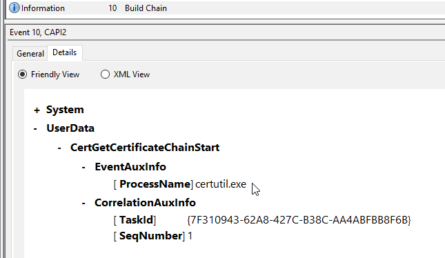

Note the **CorrelationAuxInfo** - **TaskId** and **SeqNumber** fields in this event. As the validation proceeds, the TaskId will remain constant and the SeqNumber will increment in each subsequent log entry. If the TaskId changes you are looking at an unrelated event.

The first event 10 should be followed by the Verify Revocation sequence that starts with 40 and ends (if successful) with event 41. The table below contains the sequence of events that should appear when using your locally trusted OCSP Responder to check revocation.

| **Event ID** | **Task Category** | **Details** |
| :----------: | :---------------- | :---------- |
| 40 | Verify Revocation |  |
| 52 | Retrieve Object From Network |  |
| 53 | Retrieve Object From Network | **UserData** / **CryptRetrieveObjectByUrlWire** / **URL** contains a URL for the OCSP Responder |
| 10 | Build Chain |  |
| 11 | Build Chain | **UserData** / **CertGetCertificateChain** / **Certificate** [**subjectName**] displays the common name of your OCSP Responder |
| 30 | Verify Chain Policy |  |
| 41 | Verify Revocation | **UserData** / **CertVerifyRevocation** / **OCSPResponse** [**url**] contains a URL for the OCSP Responder  |

Examine each instance of event 41 in the log. If **UserData** / **CertVerifyRevocation** / **IssuerCertificate** [**subjectName**] is a CA for which you configured an OCSP URL, examine the remaining details of the event. Confirm **UserData** / **CertVerifyRevocation** / **OCSPResponse** [**url**] contains a URL for the locally trusted OCSP Responder. If you find a different URL or no OCSPResponse section, then it did not use the local OCSP Responder.

> <i class="icon-info"></i>  The URL that appears in the event log contains the base 64 encoded OCSP Request.

### Problems and Solutions

The table below lists some event log errors you may encounter and their possible causes.

| **Error Event ID** | **Task Category** | **Details Contain** | **Possible Cause(s)**
| :----: | :----------------------- | :---------------------- | :------ |
| 11 | Build Chain | A certificate chain could not be built to a trusted root authority | If this error is preceded by event sequence 40/52/53/10, verify installation of the locally trusted OCSP Root CA certificate. &nbsp;&nbsp;&nbsp;&nbsp;*- or -* If this error appears immediately following the first event 10, a path could not be built for the certificate you are attempting to verify. Ensure all required intermediate CA certificates are available and the necessary root is installed.|
| 42 | Reject Revocation Information | CertRejectedRevocationInfo - OCSPResponse \[url] *\[your local OCSP Responder]* and Actions \[name] **CheckTimeValidity** | The OCSP Responder system clock is incorrect &nbsp;&nbsp;&nbsp;&nbsp;*- or -* An expired CRL is being used by the OCSP Responder. Confirm the "Refresh CRLs based on their validity periods" is NOT enabled in the Provider properties; configure a refresh interval instead. |
| 42 | Reject Revocation Information | CertRejectedRevocationInfo - OCSPResponse \[url] *\[your local OCSP Responder]* and Actions [name] **CheckResponseStatus** | The OCSP Responder returned "Not Authorized" because it has not been configured to respond for this CA. You will see this error if you configure the Revocation Source for an issuer without adding the corresponding configuration to the OCSP Responder. |
| 53 | Retrieve Object From Network | CryptRetrieveObjectByUrlWire - URL *\[Your OCSP Responder]* | OCSP Responder is stopped, server is offline, or server is unreachable |
| 53 | Retrieve Object From Network | CryptRetrieveObjectByUrlWire - URL *\[CRL or OCSP other than your local OCSP Responder]* | Unless preceded by the Error Event 53 described in the previous row, you should not see this error. If this occurs, confirm the Revocation Sources are configured for the Issuing CA. |

If the above table doesn't lead you to a solution, the Microsoft Tech Net article [Troubleshooting PKI Problems on Windows Vista](https://technet.microsoft.com/en-us/library/cc749296(v=ws.10).aspx) may be helpful. The article has proven to be very useful with everything from Windows Vista to Windows 10 and Server 2012 R2.

## Appendix 1 - Sample OCSP INF file
Below INF file is an example of the configuration file you can use to generate a new certificate signing request for your OCSP Responder.

 - Customize the Subject field in keeping with your Issuing CAs name
	 - The example below could be submitted to CA "CN=OCSP Issuing CA,DC=agency,DC=local"
 - Ensure KeyLength is set in keeping with the CA key sizes for which you intend to provide OCSP responses
 - If you are using an HSM, the ProviderName will need to be modified appropriately per the HSM documentation

Sample INF file for generating the OCSP responder certificate Request:

	[NewRequest]
	Subject = "CN=Local OCSP Server, DC=agency, DC=local"
	PrivateKeyArchive = FALSE
	Exportable = FALSE
	UserProtected = FALSE
	ProviderName = "Microsoft Software Key Storage Provider"
	ProviderType = 1	
	MachineKeySet = TRUE
	UseExistingKeySet = FALSE
	KeyLength = 2048
	RequestType = CMC
	
	[EnhancedKeyUsageExtension]
	OID="1.3.6.1.5.5.7.3.9"
	
	[Extensions]
	; id-pkix-ocsp-nocheck
	1.3.6.1.5.5.7.48.1.5 = "{hex}05 00"
	; the following is only needed if submitting to a CA that has multiple keys
	; uncomment and set the example hex string to the Subject Key ID of the CA
	; 2.5.29.35="{hex}30 16 80 86441F15A89DA7CA3F09F643FFE31EE9C6FC0CD6"
	
	[ApplicationPolicyStatementExtension]
	Policies = OCSPSigning
	Critical = FALSE
	
	[OCSPSigning]
	OID = 1.3.6.1.5.5.7.3.9

## Appendix 2 - Using Microsoft CA as the self signed root

Prior to configuring Certificate Services and generating the new Root CA key pair, the below CaPolicy.inf file should be placed in %SYSTEMROOT%.  Below will create a self signing root certificate with a 2048 bit RSA key and a ten year validity period with OCSP Signing (1.3.6.1.5.5.7.3.9) in the Extended Key Usage extension. 

Sample CaPolicy.inf :

	[Version]
	Signature="$Windows NT$"

	[AuthorityInformationAccess]
	; This extension will be omitted

	[CRLDistributionPoint]
	; This extension will be omitted

	[Extensions]
	; Key Usage = CertSign & CrlSign
	2.5.29.15=AwIBBg==
	Critical=2.5.29.15 

	[EnhancedKeyUsageExtension]
	OID=1.3.6.1.5.5.7.3.9 	; ocsp signing
	Critical=No

	[certsrv_server]
	LoadDefaultTemplates=0
	RenewalKeyLength=2048
	RenewalValidityPeriod=Years
	RenewalValidityPeriodUnits=10

	[BasicConstraintsExtension]
	PathLength=0
	Critical=True

> <i class="icon-info"></i>  When configuring a new CA, the setup wizard may default to using 2048 bit RSA with SHA1. At a minimum, this should be changed to 2048 bit RSA with SHA256.

Prior to issuing OCSP Responder Certificates, you must enable the OCSP-No-Check extension using the following commands:

	certutil -v -setreg policy\EnableRequestExtensionList +1.3.6.1.5.5.7.48.1.5
	-or-
	certutil -v -setreg policy\editflags +EDITF_ENABLEOCSPREVNOCHECK
	
	net stop certsvc
	net start certsvc

If this CA is dedicated to issuing OCSP Responder certificates, you may also wish to disable the CDP and AIA extensions inside the Certification Authority MMC Snap-In. Simply uncheck the "Include in the CDP/AIA extension of issued certificates" boxes for each URL in the Extensions tab. These extensions are not needed by the OCSP clients and removal improves efficiency.
